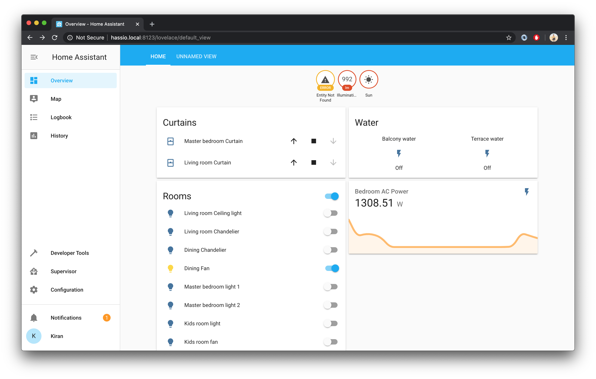

# Introduction
A [home assistant](https://www.home-assistant.io/) (hassio) component for bidirectional communication with BPL IQ home automation controller.
Use it to integrate hassio with BPL home automation, the biggest benefit being google home / alexa automation.

My setup is a raspberry pi 3b running Hass OS, connecting to the BPL controller via a local TCP socket.

Its a raw implementation, just to get things working. Lets call this v0.9 to being with. Things are not stable yet. Use at your own risk since this can void your warranty.



# How does it work ?
For almost a year, I was using the BPL home automation app. I was frustrated with the app being so laggy and the UX being so unintuitive. So I decided to see whats the protocol underneath and write a better experience for it.

A simple wireshark analysis revealed that the app opens a plain TCP socket with the BPL Controller on port 30001, and sends text commands (switch on / off) to it. And the controller responds back with a success code on the same socket, if the command was successful. For actions happening outside of this connection, like switching on a light via the wall switch or using another instance of the app, the controller broadcasts this operation via the same socket to all clients connected to it. There is also a heartbeat command which both the client and controller are supposed to send every few seconds to keep the socket alive.

This component which is running within home assistant does the exact same thing as the BPL app, and keeps a python based socket connection with the controller open throughout the lifetime. It also handles heartbeat and connection retry to keep the socket always on. You can turn on debug logs in hassio to see what's happening behind the hood.

# Setup
1. Pre requisite for using this component is to install home assistant using these [steps](https://www.home-assistant.io/hassio/installation/).

2. Copy all the files present in this repo (init.py,light.py,manifest etc)  to custom_components/bpl folder in hassio (create if it doesnt exist, refer to hassio website on how to setup custom components).

Enable the component by adding this into hassio's `configuration.yaml` 
```yaml
bpl:
```

3. After copying the files and enabling the configuration, you need to modify the `__init__.py` file as follows
Set the `DEFAULT_HOST` in the `__init__.py` file to the IP of the controller. Port will be the default port of `30001`
Then Set the sensors array to the all the lights and fans at home. Every sensor requires a bpl_id to be set correctly mandatorily.


- `bpl_id` is the `endpoint` XML attribute present in smarthome/zone/device/endpoint in the `sysdb.xml` file. To download this file, connect to your BPL controller via FTP and download this file for e.g ftp://bpl@192.168.1.10/home/root/db/sysdb.xml, default username is `bpl`, password is `123`. 
- `unique_id` is the ID which will be the entity id hassio will use internally (can be anything you wish).
- `name` is a friendly name of the entity which will be shown in the hassio lovelace UI (can be anything you wish)

4. Make sure that you dont see any errors in the hassio logs page. If everything goes well, the sensors you have added in previous step should show up in the lovelace UI > edit > Unused entities section.

# Conclusion
Once you have successfully got this up and running, you can uninstall the crappy BPL app and use HA app instead :)
